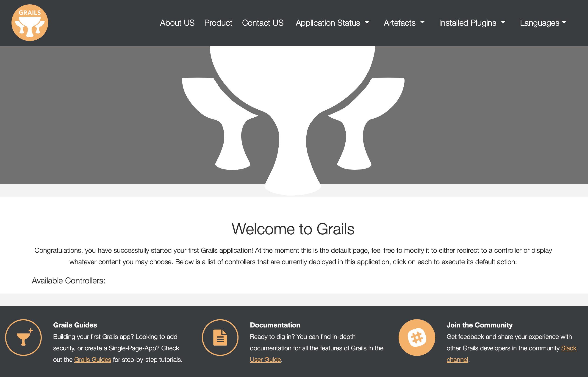

# Grails Dynamic Modules Demo

[Grails Dynamic Modules Plugin](https://github.com/rainboyan/grails-plugin-dynamic-modules)(GDMP) offer new ways of creating modular and maintainable Grails applications.

This project [Grails Dynamic Modules Demo](https://github.com/rainboyan/grails-dynamic-modules-demo) show you how to Develop dynamic modules in your Grails plugin, 
I create three plugin module types: `LanguageModuleDescriptor`, `MenuModuleDescriptor`, `MenuItemModuleDescriptor`, and use these modules to rewrite the Grails main page.



## Grails Version

- Grails **4.1.2**

## Usage

Add dependency to the `build.gradle`,

```gradle

repositories {
    mavenCentral()
}

dependencies {

    // in Grails 4
    compile "org.rainboyan.plugins:grails-plugin-dynamic-modules:0.0.1"

    // in Grails 5
    implementation "org.rainboyan.plugins:grails-plugin-dynamic-modules:0.0.1"
}

```

In the Grails Plugin project: `plugins/module`,

create a Module descriptor: `MenuModuleDescriptor`,

```groovy
@ModuleType('menu')
class MenuModuleDescriptor extends AbstractModuleDescriptor {

    String i18n
    String title
    String link
    String location
    int order

    MenuModuleDescriptor() {
    }

    @Override
    void init(GrailsPlugin plugin, Map args) throws PluginException {
        super.init(plugin, args)
        this.i18n = args.i18n
        this.title = args.title
        this.link = args.link
        this.location = args.location
    }
}
```

and then update the `ModuleGrailsPlugin` to extend `grails.plugins.DynamicPlugin`,

```groovy
class ModuleGrailsPlugin extends DynamicPlugin {

    // 1. adding custom module types
    def providedModules = [
            MenuModuleDescriptor
    ]

    // 2. define 'menu' module in doWithDynamicModules hook
    void doWithDynamicModules() {
        menu(key: 'about', i18n: 'menu.about', title: 'About US', link: '/about', location: 'topnav')
        menu(key: 'product', i18n: 'menu.product', title: 'Products', link: '/product', location: 'topnav', enabled: "${Environment.isDevelopmentMode()}") {
            description = "This menu enabled: ${Environment.isDevelopmentMode()}"
            order = 2
        }
        menu(key: 'contact', i18n: 'menu.contact', title: 'Contact', link: '/contact', location: 'topnav', enabled: false)
        menu(key: 'help', i18n: 'menu.help', title: 'Help', link: '/help', location: 'footer')
    }
}
```

now, we can get all the module descriptors in your Grails application throug the extended API of `GrailsPluginManager`,

```groovy

// Get all the ModuleDescriptors
Collection<ModuleDescriptor<?>> allDescriptors = pluginManager.getModuleDescriptors()

// Get all the enabled MenuModuleDescriptor
List<MenuModuleDescriptor> menuDescriptors = pluginManager.getEnabledModuleDescriptorsByClass(MenuModuleDescriptor)

```

I've created a sample Grails project([Grails Dynamic Modules Demo](https://github.com/rainboyan/grails-dynamic-modules-demo)) that you can run it and learn more.

## License

This plugin is available as open source under the terms of the [APACHE LICENSE, VERSION 2.0](http://apache.org/Licenses/LICENSE-2.0)

## Links

- [Grails Website](https://grails.org)
- [Grails Plugins](https://docs.grails.org/4.0.0/guide/plugins.html)
- [Grails Github](https://github.com/grails)
- [Grails Dynamic Modules Plugin](https://github.com/rainboyan/grails-plugin-dynamic-modules)
- [Grails Dynamic Modules Demo](https://github.com/rainboyan/grails-dynamic-modules-demo)
- [Project Jigsaw](https://openjdk.org/projects/jigsaw/)
- [OSGi Specifications](https://docs.osgi.org/specification/)
- [Spring Dynamic Modules Reference Guide](https://docs.spring.io/spring-osgi/docs/current/reference/html/)
